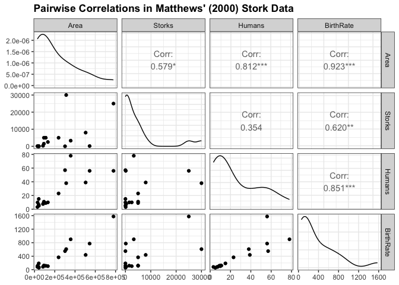
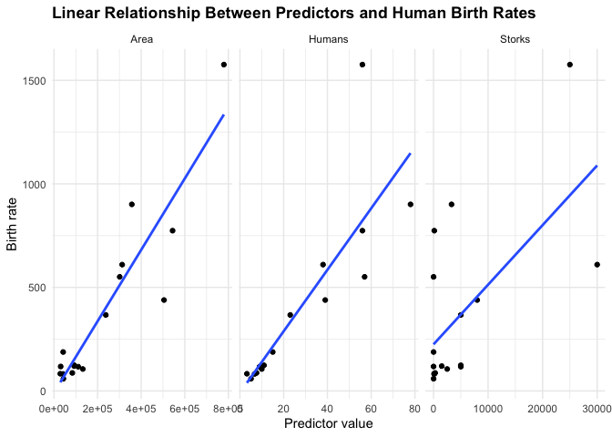
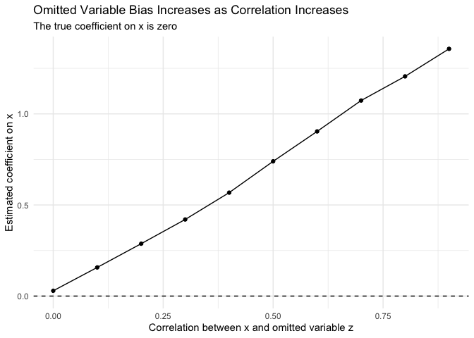

## Introduction

When estimating a regression model, we are often interested in how a
change in the level of a particular variable, or treatment, affects our
outcome of interest.

We are looking to estimate a random variable $Y$ as some function
$f(\mathbf{X})$ using a set of linear predictors $\mathbf{X}$ that we
suspect might cause $Y$. The core of the estimation problem is the
identification of which subset of all $p$ possible predictors from
$\mathbf{X} = (x_1, x_2, \ldots, x_p)$ to include in our model.

Often, the specific predictors we choose are based on substantive
considerations made during the definition of the research problem and
literature review. Together, these aspects tend to define the design of
an effective experiment to test our proposition against a null
hypothesis, $H_0$.

However, in a world of many possibilities, one of the challenges that a
researcher must beware of is the omission of variables that might be
causally related to both the outcome and the focal predictor in the
analysis. This can seriously confound the conclusions drawn from a
linear model.

## Correlation Does Not Imply Causation: Do storks deliver babies?

Suppose we are looking to question the age-old folktale of whether
storks bring newborn babies to their doting parents. Presumably, this is
because we are a little bored and feeling somewhat cynical, or because,
like behavioural maximizers, we prefer to be data-driven when given such
a tantalizingly testable proposition.

Perhaps from a similar starting point, although probably with a more
pedagogically grounded motivation, [Matthews
(2000)](http://www.brixtonhealth.com/storksBabies.pdf) presents an
analysis of real statistical data across a sample of European countries
where large stork populations mean that agencies such as the Royal
Society for the Protection of Birds painstakingly maintain records on
their numbers.

Matthews' analysis shows that the number of breeding stork pairs found
in these countries does indeed relate to human birth rates. While the
correlation is moderate, $\rho = .62$, it is statistically significant,
$p = .008$, at the $\alpha = 0.05$ or $95\%$ confidence level, meeting
the minimal convention for statistical evidence in most published
academic research.

Let's try to reproduce the results in Matthews' paper.

``` r
storks <- tribble(
  ~Country, ~Area, ~Storks, ~Humans, ~BirthRate,
  "ALB",    28750,    100,    3.2,    83,
  "AUT",    83860,    300,    7.6,    87,
  "BEL",    30520,      1,    9.9,   118,
  "BGR",   111000,   5000,    9.0,   117,
  "DNK",    43100,      9,    5.1,    59,
  "FRA",   544000,    140,   56.0,   774,
  "DEU",   357000,   3300,   78.0,   901,
  "GRC",   132000,   2500,   10.0,   106,
  "NLD",    41900,      4,   15.0,   188,
  "HUN",    93000,   5000,   11.0,   124,
  "ITA",   301280,      5,   57.0,   551,
  "POL",   312680,  30000,   38.0,   610,
  "PRT",    92390,   1500,   10.0,   120,
  "ROU",   237500,   5000,   23.0,   367,
  "ESP",   504750,   8000,   39.0,   439,
  "CHE",    41290,    150,    6.7,    82,
  "TUR",   779450,  25000,   56.0,  1576
)
```

``` r
storks %>%
  select(where(is.numeric)) %>%
  GGally::ggpairs() +
  theme_bw() +
  theme(plot.title = element_text(face = "bold")) +
  ggtitle("Pairwise Correlations in Matthews' (2000) Stork Data")
```



The number of breeding stork pairs appears to moderately correlate with
human birth rates, and this relationship is significant at
$\alpha = .05$. Very surprising indeed.

But this chart is information-dense. It tells us several additional
things:

-   Birth rates seem to correlate positively with both the human
    population and land area of these countries.
-   The number of stork pairs is also positively correlated with land
    area.
-   The distributions of the variables in our data are positively
    skewed, which is not surprising given the limited sample size.

Here is what the linear relationship between `Area`, `Humans`, `Storks`
and human birth rates looks like.

``` r
storks %>%
  pivot_longer(
    cols = c(Area, Storks, Humans),
    names_to = "predictor",
    values_to = "value"
  ) %>%
  ggplot(aes(value, BirthRate)) +
  geom_point() +
  geom_smooth(method = "lm", se = FALSE) +
  facet_wrap(vars(predictor), scales = "free_x") +
  theme_minimal() +
  theme(plot.title = element_text(face = "bold")) +
  labs(
    x = "Predictor value",
    y = "Birth rate",
    title = "Linear Relationship Between Predictors and Human Birth Rates"
  )
```



## Let's Get Hypothetical: Do storks actually deliver babies?

What if we had defined our alternative hypothesis as follows?

$$
H_A: \text{The number of breeding stork pairs in country } i \text{ is positively related to birth rates.}
$$

We might estimate the following model:

$$
\widehat{\text{BirthRate}}_i =
\beta_0 +
\beta_1 \text{Storks}_i +
\beta_2 \text{Humans}_i +
\beta_3 \text{Area}_i +
\epsilon_i
$$

Suppose we collected data to test this proposition against a null
hypothesis, but for whatever reason, we only collected data on two
variables: `Storks` and `BirthRate`. We would then estimate this
relationship using a linear model of the form:

$$
\widehat{\text{BirthRate}}_i =
\beta_0 +
\beta_1 \text{Storks}_i +
\epsilon_i
$$

Since we have the measurements to estimate both models, let's fit and
compare their results.

``` r
model1 <- lm(BirthRate ~ Storks, data = storks)
summary(model1)
```

    ## 
    ## Call:
    ## lm(formula = BirthRate ~ Storks, data = storks)
    ## 
    ## Residuals:
    ##    Min     1Q Median     3Q    Max 
    ## -478.8 -166.3 -144.9   -2.0  631.1 
    ## 
    ## Coefficients:
    ##              Estimate Std. Error t value Pr(>|t|)   
    ## (Intercept) 2.250e+02  9.356e+01   2.405   0.0295 * 
    ## Storks      2.879e-02  9.402e-03   3.063   0.0079 **
    ## ---
    ## Signif. codes:  0 '***' 0.001 '**' 0.01 '*' 0.05 '.' 0.1 ' ' 1
    ## 
    ## Residual standard error: 332.2 on 15 degrees of freedom
    ## Multiple R-squared:  0.3847, Adjusted R-squared:  0.3437 
    ## F-statistic:  9.38 on 1 and 15 DF,  p-value: 0.007898

``` r
model2 <- lm(BirthRate ~ Storks + Humans + Area, data = storks)
summary(model2)
```

    ## 
    ## Call:
    ## lm(formula = BirthRate ~ Storks + Humans + Area, data = storks)
    ## 
    ## Residuals:
    ##     Min      1Q  Median      3Q     Max 
    ## -317.24  -52.95    2.44   73.89  295.48 
    ## 
    ## Coefficients:
    ##               Estimate Std. Error t value Pr(>|t|)  
    ## (Intercept) -4.824e+01  5.172e+01  -0.933   0.3680  
    ## Storks       8.965e-03  5.024e-03   1.784   0.0977 .
    ## Humans       6.369e+00  2.635e+00   2.417   0.0311 *
    ## Area         9.596e-04  3.240e-04   2.962   0.0110 *
    ## ---
    ## Signif. codes:  0 '***' 0.001 '**' 0.01 '*' 0.05 '.' 0.1 ' ' 1
    ## 
    ## Residual standard error: 140.3 on 13 degrees of freedom
    ## Multiple R-squared:  0.9049, Adjusted R-squared:  0.8829 
    ## F-statistic: 41.23 on 3 and 13 DF,  p-value: 6.644e-07

Interesting. In both models, the estimate for the relationship between
the number of breeding stork pairs and human birth rates is very
different. When we control for `Area` and the number of `Humans` in
these countries, the coefficient on `Storks` becomes much smaller and is
no longer statistically significant at the conventional $\alpha = .05$
level.

Mathews' is a good example of how an omitted variable can change the
interpretation of a regression coefficient. In the simple model,
`Storks` appears to explain birth rates. But once we account for country
size and population, the apparent relationship becomes much weaker.

## Reproducing Omitted Variable Bias with Simulated Data

We can also reproduce the logic of omitted variable bias using simulated
data.

Suppose the true data-generating process is:

$$
Y_i = \beta_0 + \beta_1 x_i + \gamma z_i + \epsilon_i
$$

where $x_i$ is the focal predictor and $z_i$ is an omitted variable. If
$z_i$ affects $Y_i$ and is correlated with $x_i$, then a regression that
omits $z_i$ will generally produce a biased estimate of $\beta_1$.

``` r
set.seed(42)

N <- 10000

beta_0 <- 1.5
beta_1 <- 0
gamma <- 1.5
rho <- 0.6

x <- rnorm(N, mean = 0, sd = 1)

z <- rho * x + sqrt(1 - rho^2) * rnorm(N, mean = 0, sd = 1)

epsilon <- rnorm(N, mean = 0, sd = 1)

Y <- beta_0 + beta_1 * x + gamma * z + epsilon

sim_data <- tibble(Y, x, z)
```

The key point is that the true effect of `x` is zero, because
`beta_1 <- 0`. However, `z` affects `Y`, and `z` is correlated with `x`.
If we omit `z`, the model may mistakenly attribute part of the effect of
`z` to `x`.

``` r
m1 <- lm(Y ~ x, data = sim_data)
summary(m1)
```

    ## 
    ## Call:
    ## lm(formula = Y ~ x, data = sim_data)
    ## 
    ## Residuals:
    ##     Min      1Q  Median      3Q     Max 
    ## -5.9979 -1.0488  0.0065  1.0870  5.8487 
    ## 
    ## Coefficients:
    ##             Estimate Std. Error t value Pr(>|t|)    
    ## (Intercept)  1.50899    0.01586   95.12   <2e-16 ***
    ## x            0.89258    0.01577   56.61   <2e-16 ***
    ## ---
    ## Signif. codes:  0 '***' 0.001 '**' 0.01 '*' 0.05 '.' 0.1 ' ' 1
    ## 
    ## Residual standard error: 1.586 on 9998 degrees of freedom
    ## Multiple R-squared:  0.2427, Adjusted R-squared:  0.2427 
    ## F-statistic:  3205 on 1 and 9998 DF,  p-value: < 2.2e-16

``` r
m2 <- lm(Y ~ x + z, data = sim_data)
summary(m2)
```

    ## 
    ## Call:
    ## lm(formula = Y ~ x + z, data = sim_data)
    ## 
    ## Residuals:
    ##     Min      1Q  Median      3Q     Max 
    ## -3.7150 -0.6969  0.0048  0.6924  4.0674 
    ## 
    ## Coefficients:
    ##              Estimate Std. Error t value Pr(>|t|)    
    ## (Intercept)  1.508099   0.010141 148.713   <2e-16 ***
    ## x           -0.006471   0.012548  -0.516    0.606    
    ## z            1.513134   0.012579 120.289   <2e-16 ***
    ## ---
    ## Signif. codes:  0 '***' 0.001 '**' 0.01 '*' 0.05 '.' 0.1 ' ' 1
    ## 
    ## Residual standard error: 1.014 on 9997 degrees of freedom
    ## Multiple R-squared:  0.6906, Adjusted R-squared:  0.6905 
    ## F-statistic: 1.116e+04 on 2 and 9997 DF,  p-value: < 2.2e-16

In the omitted-variable model, the coefficient on `x` captures both the
true effect of `x` and part of the effect of the omitted variable `z`.
In the full model, where `z` is included, the estimated coefficient on
`x` should be much closer to its true value of zero.

We can also see how omitted-variable bias changes as the correlation
between `x` and `z` changes.

``` r
set.seed(123)

rhos <- seq(0, 0.9, by = 0.1)

bias_results <- map_dfr(rhos, function(rho) {
  x <- rnorm(N, mean = 0, sd = 1)
  z <- rho * x + sqrt(1 - rho^2) * rnorm(N, mean = 0, sd = 1)
  epsilon <- rnorm(N, mean = 0, sd = 1)

  Y <- beta_0 + beta_1 * x + gamma * z + epsilon

  omitted_model <- lm(Y ~ x)
  full_model <- lm(Y ~ x + z)

  tibble(
    rho = rho,
    omitted_model_estimate = coef(omitted_model)[["x"]],
    full_model_estimate = coef(full_model)[["x"]]
  )
})
```

``` r
bias_results %>%
  ggplot(aes(rho, omitted_model_estimate)) +
  geom_point() +
  geom_line() +
  geom_hline(yintercept = beta_1, linetype = "dashed") +
  theme_minimal() +
  labs(
    x = "Correlation between x and omitted variable z",
    y = "Estimated coefficient on x",
    title = "Omitted Variable Bias Increases as Correlation Increases",
    subtitle = "The true coefficient on x is zero"
  )
```



The stronger the correlation between the included predictor `x` and the
omitted predictor `z`, the larger the omitted-variable bias becomes.
This is why regression modelling is not just a mechanical exercise in
fitting lines. It also requires careful thinking about the causal
structure of the variables being studied.
